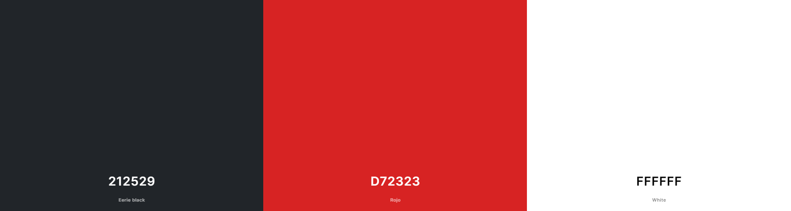

# ReelTalk

ReelTalk was created as my third milestone project, built using a Flask framework alongside PostgreSQL.

[View ReelTalk on GitHub Pages](https://rdhadda.github.io/ReelTalk/index.html)

## CONTENTS

- [User Experience (UX)](#User-Experience-UX)

  - [User Stories](#User-Stories)

- [Design](#Design)

  - [Colour Scheme](#Colour-Scheme)
  - [Typography](#Typography)
  - [Imagery](#Imagery)
  - [Wireframes](#Wireframes)
  - [Features](#Features)
    - [The Home Page](#home-page)
    - [The Game Page](#games-page)
    - [The Scores Page](#scores-page)
    - [The 404 Error Page](#404-error-page)
  - [Accessibility](#Accessibility)

- [Technologies Used](#Technologies-Used)

  - [Languages Used](#Languages-Used)
  - [Frameworks, Libraries & Programs Used](#Frameworks,-Libraries-and-Programs-Used)

- [Deployment and Local Development](#Deployment-and-Local-Development)

  - [Deployment](#Deployment)
  - [Local Development](#Local-Development)
    - [How to Fork](#How-to-Fork)
    - [How to Clone](#How-to-Clone)

- [Testing](#Testing)

  - [Solved Bugs](#Solved-Bugs)
  - [Known Bugs](#Known-Bugs)

- [Credits](#Credits)
  - [Code Used](#Code-Used)
  - [Media](#Media)
  - [Acknowledgments](#Acknowledgments)

---

## User Experience (UX)

The purpose of the website is to allow users to create an account, search for a movie and leave a review as well as reading other users reviews on movies. The user also has the ability to delete their review. 

#### Target Audience

The target audience for ReelTalk are movie lovers who like to review movies and read other peoples reviews. 

### User Stories

#### First Time Visitor Goals

- Register for an account.
- Search for movies.
- Understand what the site is for and easily navigate their way around.

#### Returning Visitor Goals

- Log into created account.
- Create, edit, delete my reviews.
- Read other user's reviews.

#### Frequent Visitor Goals

- Log into created account.
- Create, edit, delete my reviews.
- Read other user's reviews.

## Design

### Colour Scheme

The red, white, and black color scheme is bold and modern, offering a high-contrast, visually engaging design. This theme combines the elegance of black, the cleanliness of white, and the vibrant energy of red to create an impactful user experience. The [coolors](https://coolors.co/) website was used to develop the colour palette.

### Typography

Google Fonts was used for the following fonts:

- Barrio is used for the main ReelTalk logo.
- Anta is used for the remaining text.

### Imagery

All images on the webpage were taken from TMDB. I have credited these in the [credits](#credits) section.

### Wireframes

Wireframes were created for mobile, tablet and desktop using Balsamiq.

[Desktop Wireframes](documentation/desktop-wireframe.png)

[Tablet Wireframes](documentation/tablet-wireframe.png)

[Mobile Wireframes](documentation/mobile-wireframe.png)

### Features

The website consists of 10 pages. which are extended from a base template.

- Home Page
- Login Page
- Sign Up Page
- Search Page
- Search Results Page
- Add Review Page
- Edit Review Page
- My Reviews Page
- Movie Reviews Page
- 404 Page

#### All 10 pages have the following elements in common:

- Navbar - The navbar is present on all pages throughout the website. This allows each user to naviagte their way around the website with ease. It consists of the ReelTalk logo on the left hand side and the nav links on the right. The nav links has an active attribute on them and his highlighted in red to show the user which page they're on. Certain nav links are only visible if the user is logged in. 

  #### User Logged In
  #### User Logged Out

- Footer - The footer is also present on each webpage and has links to ReelTalk's social media pages. 

### Future Implementations

- Allow a user to update their password.
- Allow a user to delete their account.
- Add a movie rating to each movie.
- Create an Admin account to delete non-appropriate reviews.
- Allow a user to add a movie if it's not found via the TMDB API.

## Accessbility

- Using semantic HTML.
- Creating sufficient colour contrast throughout the website.
- Using descriptive alt attributes for images throughout the site.

## Technologies Used

### Languages Used

- HTML, CSS and Javascript, Python

