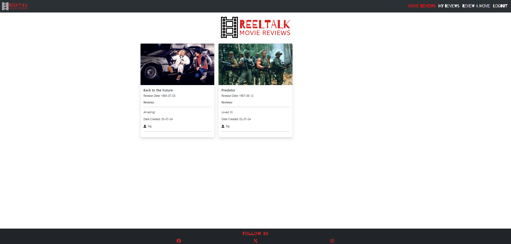

# ReelTalk

ReelTalk was created as my third milestone project, built using a Flask framework alongside PostgreSQL.


[View ReelTalk on Heroku](https://reeltalk-rd-86df5744ce6e.herokuapp.com/)


## CONTENTS

- [User Experience (UX)](#User-Experience-UX)

  - [User Stories](#User-Stories)

- [Design](#Design)

  - [Colour Scheme](#Colour-Scheme)
  - [Typography](#Typography)
  - [Imagery](#Imagery)
  - [Wireframes](#Wireframes)
  
- [Features](#Features)
    - [Web Pages](#web-pages)
    - [Accessibility](#Accessibility)

- [Technologies Used](#Technologies-Used)
  - [Languages Used](#Languages-Used)
  - [Frameworks, Libraries & Programs Used](#frameworks-libraries-and-programs-used)

- [Deployment and Local Development](#deployment--local-development)  
    - [Local Development](#Local-Development)
    - [Remote Deployment](#remote-deployment-heroku)
   

- [Testing](#Testing)

  - [Solved Bugs](#Solved-Bugs)
  - [Known Bugs](#Known-Bugs)

- [Credits](#Credits)
  - [Code Used](#Code-Used)
  - [Media](#Media)
  - [Acknowledgments](#Acknowledgments)

---

## User Experience (UX)

ReelTalk is a website aimed at movie lovers. A user has the ability to search for their desired movie and leave a review, once they have signed up to the website to share with other users. The user also has the ability to modify their existing reviews and delete a review if they choose to do so. 

#### Target Audience

The target audience for ReelTalk are movie lovers who like to review movies and read other peoples reviews. 

### User Stories

#### First Time Visitor Goals

- Register for an account.
- Search for movies.
- Understand what the site is for and easily navigate their way around.

#### Returning Visitor Goals

- Log into created account.
- Create, edit, and delete my reviews.
- Read other user's reviews.


#### Frequent Visitor Goals

- Log into created account.
- Create, edit, and delete my reviews.
- Read other user's reviews.

## Design

### Colour Scheme


The red, white, and black color scheme is bold and modern, offering a high-contrast, visually engaging design. This theme combines the elegance of black, the cleanliness of white, and the vibrant energy of red to create an impactful user experience. The [coolors](https://coolors.co/) website was used to develop the colour palette.

### Typography

Google Fonts was used for the following fonts:

- Barrio is used for the main ReelTalk logo, nav links and footer text.


- Helvecta is used for the remaining text across the website.


### Imagery

All images on the webpage were taken from TMDB. I have credited these in the [credits](#credits) section.

### Wireframes

Wireframes were created for mobile, tablet and desktop using Balsamiq.

[Desktop Wireframes](documentation/desktop-wireframe.png)

[Tablet Wireframes](documentation/tablet-wireframe.png)

[Mobile Wireframes](documentation/mobile-wireframe.png)

### Features

The website consists of 11 pages. which are extended from a base template.

- Home Page
- Login Page
- Sign Up Page
- Search Page
- Search Results Page
- Add Review Page
- Edit Review Page
- Delete Review (Modal)
- My Reviews Page
- Movie Reviews Page
- 404 Page
- 500 Page


#### All 11 pages have the following elements in common:

- Navbar - The navbar is present on all pages throughout the website. This allows each user to navigate their way around the website with ease. It consists of the ReelTalk logo on the left-hand side and the nav links on the right. The nav links have an active attribute on them and his highlighted in red to show the user which page they're on. Certain nav links are only visible if the user is logged in. 

 #### User Logged Out


 #### User Logged In

 

#### Nav Links

- The nav links are highlighted in red highlighting which page the user is on.

#### Footer
 
- Footer - The footer is also present on each webpage and has links to ReelTalk's social media pages. 


## Web Pages

## Home Page


- The homepage introduces the user to the website, it also shows the top 12 trending movies of the week. The signup and login buttons are only visible if the user is not logged in.

## Sign Up Page

![sign-up-page]The signup page allows the user to create an account for ReelTalk. An account is required in order to search for movies, leave reviews, edit and delete reviews. 

## Login Page


- The login page allows the user to login to the website. 

## Movie Reviews Page



- The movie reviews page shows reviews posted by all users. This is a read-only page. 

## My Reviews Page


- The my reviews page displays all the reviews posted by the logged in user. From here the user can modify existing reviews or can delete their review. Only the original poster can modify or delete their own reviews. 

## Search Movies Page


- The search movies page allows a user to search for a movie using the TMDB database.

## Search Results Page


- The search results page displays all of the movies relating to the search query. For the movies that do not have an image, I opted to use a stock image from TMDB rather than not displaying an image. The user can simply click on the image to take them to the review form.

## Leave A Review Page


- This page allows the user to create a review of their chosen movie. Once submitted the review is stored in the database.

## Edit A Review Page


- The edit review page allows a user to edit a review they have previously created. The edit button is only visible to the user who created the review. The code also checks to see if the logged-in user matches the user ID of the person who posted the review.

## Delete A Review Page


- The delete review page allows a user to delete a review they have previously created. The delete button is only visible to the user who created the review. The code also checks to see if the logged-in user matches the user ID of the person who posted the review. A modal is then displayed to confirm whether the user wants to delete the review.

## 404 Page


- The user is directed to the 404 page if a page cannot be found.

## 500 Page


- The user is directed to the 500 page if there is an internal server error.


### Future Implementations

- Allow a user to update their password.
- Allow a user to delete their account.
- Add a movie rating to each movie.
- Create an Admin account to delete inappropriate reviews.
- Allow a user to add a movie if it's not found via the TMDB API.
- Give the ability to search for movie reviews.


## Accessbility

- Using semantic HTML.
- Creating sufficient colour contrast throughout the website.
- Using descriptive alt attributes for images throughout the site.

## Technologies Used

### Languages Used

- HTML, CSS, Javascript and Python

### Frameworks, Libraries and Programs Used

### Database Used

[PostgreSQL](https://www.postgresql.org/) - Relational database used to store the users, movies and reviews.

### Frameworks Used

[Flask](https://pypi.org/project/Flask/) - A micro-framework. Flask login was used alongside Flask to manage user accounts. Flask-Login provides user session management for Flask. It handles the common tasks of logging in, logging out, and remembering your users' sessions over extended periods.

Werkzueg-Security - This allows passwords to be hashed to provide account security to the users of the website. Passwords will not be stored as plain-text and stored as hash which is irreversible to plaintext. This is known as a one way hash.

[Bootstrap](https://getbootstrap.com/) - v5.3.3 - CSS Framework.

### Libraries and Packages Used

[SQLAlchemy](https://pypi.org/project/SQLAlchemy/) - Database abstraction library, used to interact with PostgreSQL.

[Pip](https://pypi.org/project/pip/) - Tool for installing Python packages.

[Jinja](https://jinja.palletsprojects.com/en/3.1.x/) - Templating engine.

[Balsamiq](https://balsamiq.com/) - Used to create wireframes.

[Git](https://git-scm.com/) - For version control.

[Github](https://github.com/) - To save and store the files for the website.

[Gitpod](https://gitpod.com/) - IDE to create the project.

[Google Fonts](https://fonts.google.com/) - To import the fonts used on the website.

Google Dev Tools - To troubleshoot and test features, and solve issues with responsiveness and styling.

[Am I Responsive](https://ui.dev/amiresponsive) To show the website across a range of devices.

[Fontawsome](https://fontawesome.com/start) For the cross and tick.

[Squoosh](https://squoosh.app/) Compress images and convert to webp format.

[Sheilds](https://shields.io/) Add badges to README.

[Lucid Chart](https://lucid.app) To create the database schema.

### TMDB API

[TMDB](https://themoviedb.org/) API for movie searches.

- I chose to implement the TMDB API to allow users to search their extensive database for them to leave a review. I chose to store my TMDB API key within the env.py to keep it hidden and then to call it within the necessary route when needed `api_key = os.environ.get("API_KEY")`.

### Defensive Programming

- I opted to use defensive programming to improve the quality of ReelTalk. I've chosen to do this in a number of ways

  - Firstly I've only given the ability to view the website to logged-in users. 
  - Logged-in users are able to create, modify or delete reviews, however, they can only do this if they're the original creator of the review. The code checks whether the current user who is logged in is the user who created the review. If they're not then a message will appear stating that they do not have permission to edit/delete the post.  `current_user.id != user_review.user_id:
        flash('You do not have permission to edit this review', category='error')`
  - I've also implemented flash messages to highlight to the user when an action has been successful or unsuccessful. 
  - All database activities are wrapped in a try, except blocks. If the add or commit to the database is not successful then the database is rolled back and a 500.html page is displayed to the user indicating an internal server error.

 - This should hopefully reduce the likelihood of bugs and crashes within the application and provide a positive user experience. 

## Deployment & Local Development

### Local Development

- For local deployment, the following must be installed:

- [Python 3.12.2](www.python.org) - In order to run the application.
- [VS Code](https://code.visualstudio.com/) - Or any other suitable IDE.
- [Pip 24.0](https://pypi.org/project/pip/) - Pacakage installer for python.
- [Github](https://github.com/) - In order to clone and manage the repository.
- [PostgreSQL](https://www.postgresql.org/) - In order to create and manage the database.

#### Setup

1. Clone the reeltalk repository:

   - To clone the ReelTalk repository

      1. Log in (or sign up) to GitHub.
      2. Go to the repository for this project, rdhadda/ReelTalk
      3. Click on the code button, select whether you would like to clone with HTTPS, - SSH or GitHub CLI and copy the link shown.
      4. Open the terminal in your code editor and change the current working directory to the location you want to use for the cloned directory.
      5. Type 'git clone' into the terminal and then paste the link you copied in step 3. Press enter.

2. Create an env.py file in the root directory of the project. Please refer to sample_env.py file for an example. To use the TMDB database you would need to sign up to the TMDB website. Intructions to register for an API [TMDB API](https://developer.themoviedb.org/docs/getting-started)

3. Type the following command into the terminal to install the Python packages used in Reeltalk.

   - `pip3 install -r requirements.txt`

4. Create the database using PostgreSQL. Type the following commands into the terminal.

   - `set_pg`
   - `psql`
   - `CREATE DATABASE reeltalk`

5. Add the tables to the reeltalk database using the following commands in the terminal:

    - `python3`
    - `from reeltalk import db`
    - `db.create_all()`
    - `exit()`

- The tables from models.py should now have been added to the reeltalk database.

6. To check the tables have been created, the following commands can be run:

     - `set_pg`
     - `psql`
     - `\c reeltalk`
     - `\dt`
- These commands will display all the created tables within the reeltalk database.

7. The reeltalk application can now be run by typing the below into the terminal:

    - `python3 run.py`

### Remote Deployment Heroku

1. Create a database using [CI Database Maker](https://dbs.ci-dbs.net/). Once created, a URL to the database will be provided. Save this URL for later on in the process.

2. In order for Heroku to run the project, two files need to be created in the IDE workspace.

    - A requirements.txt file contains a list of the Python dependencies that our project needs to run successfully.
    - A Procfile contains the start command to run the project.

- To create the requirements.txt file, run the following command in the terminal:

    ```bash
    pip3 freeze --local > requirements.txt
    ```
- To create the Procfile run the following command in the terminal:

    ```bash
    echo web: python app.py > Procfile
    ```

    NOTE: The Procfile uses a capital P and doesn't have a file extension on the end. Ensure there is no blank line at the end of the file as this can cause problems for deployment.

    Save all files then add, commit and push the changes to GitHub.

3. Login (or sign up) to [Heroku.com](https://www.heroku.com).

4. Click the new button and then click Create New App.

5. Choose a unique name for your app, select the region closest to you and click “Create app.

6. Go to the Settings tab of your new app.

7. Click Reveal Config Vars.

8. Add a Config Var called DATABASE_URL and paste your CI database URL in as the value. Make sure you click “Add”.

9. Add each of your other environment variables except DEVELOPMENT and DB_URL from the env.py file as a Config Var. The result should look something like this:

   

 - NOTE: Delete the DEBUG variable once debugging is complete. Don't wrap strings in quotes. To use the TMDB database you would need to sign upto the TMDB website. Intructions to register for an API [TMDB API](https://developer.themoviedb.org/docs/getting-started)

10. Navigate to the “Deploy” tab of your app.

11. In the Deployment method section, select “Connect to GitHub”.

12. Search for rdhadda/reeltalk repo and click Connect.

13. Optional: You can click Enable Automatic Deploys in case you make any further changes to the project. This will trigger any time code is pushed to your GitHub repository.

14. Click Deploy Branch - This will start the build process.

15. Similarly to local deployment, the tables from models.py need to be added to the database.

    - To do this, we can click the “More” button and select “Run console”.
    - Type python3 into the console and click Run.
    - This opens the Python terminal. Now create the tables with the commands:

        ```bash
           from reeltalk import db
        ```
        ```bash
           db.create_all()
        ```
        ```bash
           exit()
        ```

16. The app should now be up and running. Click "Open app" to view the deployed project.

## Testing

Please see [TESTING.md](TESTING.md) file for both automated and manual testing of ReelTalk.

## Credits

### Code Used

- I used [Tech with Tim's YouTube channel](https://www.youtube.com/@TechWithTim) to help with flask_login and flash messages.
- I used the following website to help organize movie reviews by movie title on the movie reviews page [webforefront](https://www.webforefront.com/django/usebuiltinjinjafilters.html#google_vignette).
- [404 [error code](https://www.geeksforgeeks.org/python-404-error-handling-in-flask/) Geeks for geeks website helped me handle the code for the 404 page. 
- [500 Internal Server Error](https://flask.palletsprojects.com/en/2.3.x/errorhandling/) flask.palletsproject helped me to implement a 500 internal server error handler.

### Media

- [Logo.com](https://logo.com/login?returnTo=%2Fdashboard) for the ReelTalk logo.
- [TMDB](https://www.themoviedb.org/) for all movie information and images.

### Acknowledgments

- My mentor for their guidance and support.
- Oisin from tutor support for helping me to deploy my project to Heroku.
- My cohort for support.
- Code Institute for informative course material.
- The Slack community for help and support.
