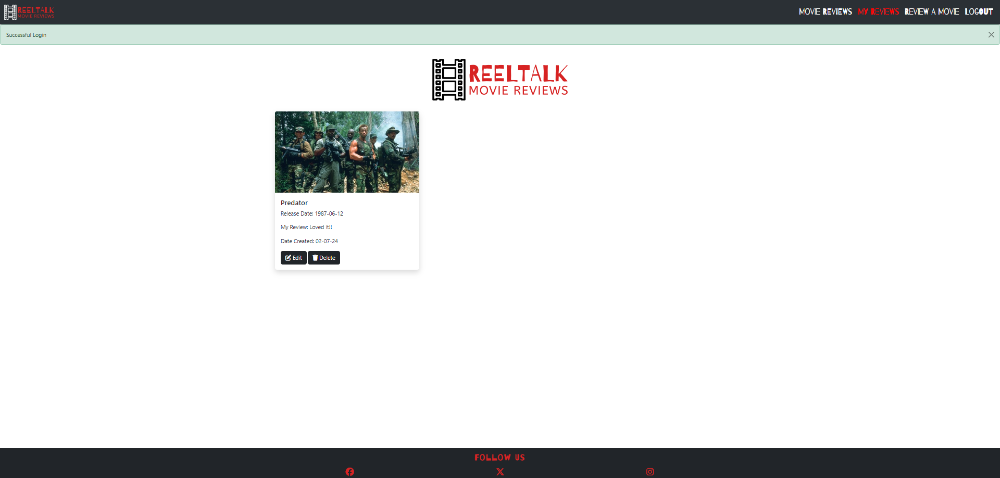

# ReelTalk

ReelTalk was created as my third milestone project, built using a Flask framework alongside PostgreSQL.

[View ReelTalk on GitHub Pages](https://rdhadda.github.io/ReelTalk/index.html)

## CONTENTS

- [User Experience (UX)](#User-Experience-UX)

  - [User Stories](#User-Stories)

- [Design](#Design)

  - [Colour Scheme](#Colour-Scheme)
  - [Typography](#Typography)
  - [Imagery](#Imagery)
  - [Wireframes](#Wireframes)
  - [Features](#Features)
    - [The Home Page](#home-page)
    - [The Game Page](#games-page)
    - [The Scores Page](#scores-page)
    - [The 404 Error Page](#404-error-page)
  - [Accessibility](#Accessibility)

- [Technologies Used](#Technologies-Used)

  - [Languages Used](#Languages-Used)
  - [Frameworks, Libraries & Programs Used](#Frameworks,-Libraries-and-Programs-Used)

- [Deployment and Local Development](#Deployment-and-Local-Development)

  - [Deployment](#Deployment)
  - [Local Development](#Local-Development)
    - [How to Fork](#How-to-Fork)
    - [How to Clone](#How-to-Clone)

- [Testing](#Testing)

  - [Solved Bugs](#Solved-Bugs)
  - [Known Bugs](#Known-Bugs)

- [Credits](#Credits)
  - [Code Used](#Code-Used)
  - [Media](#Media)
  - [Acknowledgments](#Acknowledgments)

---

## User Experience (UX)

The purpose of the website is to allow users to create an account, search for a movie and leave a review as well as reading other users reviews on movies. The user also has the ability to delete their review. 

#### Target Audience

The target audience for ReelTalk are movie lovers who like to review movies and read other peoples reviews. 

### User Stories

#### First Time Visitor Goals

- Register for an account.
- Search for movies.
- Understand what the site is for and easily navigate their way around.

#### Returning Visitor Goals

- Log into created account.
- Create, edit, delete my reviews.
- Read other user's reviews.

#### Frequent Visitor Goals

- Log into created account.
- Create, edit, delete my reviews.
- Read other user's reviews.

## Design

### Colour Scheme

The red, white, and black color scheme is bold and modern, offering a high-contrast, visually engaging design. This theme combines the elegance of black, the cleanliness of white, and the vibrant energy of red to create an impactful user experience. The [coolors](https://coolors.co/) website was used to develop the colour palette.

### Typography

Google Fonts was used for the following fonts:

- Barrio is used for the main ReelTalk logo.
- Anta is used for the remaining text.

### Imagery

All images on the webpage were taken from TMDB. I have credited these in the [credits](#credits) section.

### Wireframes

Wireframes were created for mobile, tablet and desktop using Balsamiq.

[Desktop Wireframes](documentation/desktop-wireframe.png)

[Tablet Wireframes](documentation/tablet-wireframe.png)

[Mobile Wireframes](documentation/mobile-wireframe.png)

### Features

The website consists of 10 pages. which are extended from a base template.

- Home Page
- Login Page
- Sign Up Page
- Search Page
- Search Results Page
- Add Review Page
- Edit Review Page
- My Reviews Page
- Movie Reviews Page
- 404 Page

#### All 10 pages have the following elements in common:

- Navbar - The navbar is present on all pages throughout the website. This allows each user to naviagte their way around the website with ease. It consists of the ReelTalk logo on the left hand side and the nav links on the right. The nav links has an active attribute on them and his highlighted in red to show the user which page they're on. Certain nav links are only visible if the user is logged in. 

## Home Page

## Movie Reviews Page

## My Reviews Page

## Search Reviews Page

## Search Results Page

## Leave A Review Page

## Edit A Review Page

## Delete A Review Page

## 404 Page

 #### User Logged Out

 #### User Logged In

 
 
- Footer - The footer is also present on each webpage and has links to ReelTalk's social media pages. 

### Future Implementations

- Allow a user to update their password.
- Allow a user to delete their account.
- Add a movie rating to each movie.
- Create an Admin account to delete non-appropriate reviews.
- Allow a user to add a movie if it's not found via the TMDB API.
- Give the ability to search for movie reviews.

## Accessbility

- Using semantic HTML.
- Creating sufficient colour contrast throughout the website.
- Using descriptive alt attributes for images throughout the site.

## Technologies Used

### Languages Used

- HTML, CSS, Javascript and Python

### Frameworks, Libraries and Programs Used

### Database Used

[PostgreSQL](https://www.postgresql.org/) - Relational database used to store the users, movie's and reviews.

### Frameworks Used

[Flask](https://pypi.org/project/Flask/) - A micro framework. Flask login was used alongside Flask in order to manage user accounts. Flask-Login provides user session management for Flask. It handles the common tasks of logging in, logging out, and remembering your users' sessions over extended periods of time.

Werkzueg-Security - This allows passwords to be hashed in order to provide account security to the users of the website. Passwords will not be stored as plain-text and stored as hash which is irreversible to plaintext. This is known as a one was hash.

[Bootstrap](https://getbootstrap.com/) - v5.3.3 - CSS Framework.

### Libraries and Packages Used

[SQLAlchemy](https://pypi.org/project/SQLAlchemy/) - Database abstraction library, used to interact with PostgreSQL.

[Pip](https://pypi.org/project/pip/) - Tool for installing python packages.

[Jinja](https://jinja.palletsprojects.com/en/3.1.x/) - Templating engine.

[Balsamiq](https://balsamiq.com/) - Used to create wireframes.

[Git](https://git-scm.com/) - For version control.

[Github](https://github.com/) - To save and store the files for the website.

[Gitpod](https://gitpod.com/) - IDE to create the project.

[Google Fonts](https://fonts.google.com/) - To import the fonts used on the website.

Google Dev Tools - To troubleshoot and test features, and solve issues with responsiveness and styling.

[Am I Responsive](https://ui.dev/amiresponsive) To show the website across a range of devices.

[Fontawsome](https://fontawesome.com/start) For the cross and tick.

[Squoosh](https://squoosh.app/) Compress images and convert to webp format.

[Sheilds](https://shields.io/) Add badges to README.

[Lucid Chart](https://lucid.app) To create the database schema.

### TMDB API

[TMDB](https://themoviedb.org/) API for movie searches.

- I chose to implement the TMDB API to allow users to search their extensive database in order for them to leave a review. I chose to store my TMDB api key within the env.py to keep it hidden and then to call it within the necessary route when needed `api_key = os.environ.get("API_KEY")`.

### Defensive Programming

- I opted to use defensive programming to improve the quality of ReelTalk. I've chosen to do this in a number of ways

  - Firstly I've only given the ability to view the website to logged in users. 
  - Logged in users are able to create, modify or delete reviews, however, they can only do this if they're the original creator of the review. The code checks whether the current user which is logged in is the user whom created the review. If they're not then a message will appear stating that they do not have permission to edit/delete the post.  `current_user.id != user_review.user_id:
        flash('You do not have permission to edit this review', category='error')`
  - I've also implemented flash messages to highlight to the user when an action has been succesful or unsucessful. 

 - This should hopefully reduce the likehood of bugs and crashes within the application and provide a positive user experience. 

### Local Development

#### How to Fork

To fork the repository:

1. Log in (or sign up) to Github.
2. Go to the repository for this project, rdhadda/ReelTalk
3. Click the Fork button in the top right corner.

#### How to Clone

To clone the ReelTalk repository:

1. Log in (or sign up) to GitHub.
2. Go to the repository for this project, rdhadda/ReelTalk
3. Click on the code button, select whether you would like to clone with HTTPS, SSH or GitHub CLI and copy the link shown.
4. Open the terminal in your code editor and change the current working directory to the location you want to use for the cloned directory.
5. Type 'git clone' into the terminal and then paste the link you copied in step 3. Press enter.

## Testing

Please see [TESTING.md](TESTING.md) file for both automated and manual testing.

## Credits

### Code Used

- I used [Tech with Tim's youtube channel](https://www.youtube.com/@TechWithTim) to help with flask_login and flash messages.
- I used the following website to help organise movie reviews by movie title on the movie reviews page [webforefront](https://www.webforefront.com/django/usebuiltinjinjafilters.html#google_vignette).
- [404 error code](https://www.geeksforgeeks.org/python-404-error-handling-in-flask/) geeks for geeks website helped me handle the code for the 404 page. 

### Media

- [Logo.com](https://logo.com/login?returnTo=%2Fdashboard) for the ReelTalk logo.
- [TMDB](https://www.themoviedb.org/) for all movie information and images.

### Acknowledgments

- My mentor for their guidance and support.
- My cohort for support.
- Code Institute for informative course material.
- The Slack community for help and support.
- Code Institute tutor support.